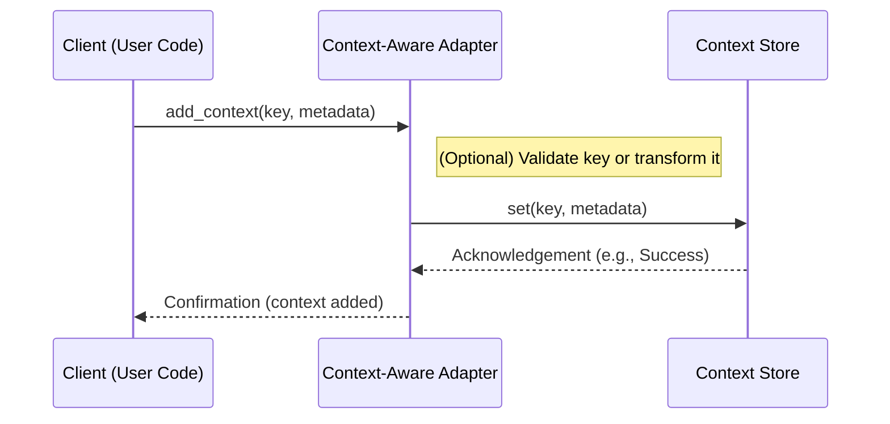
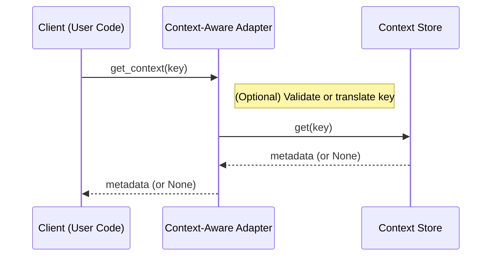
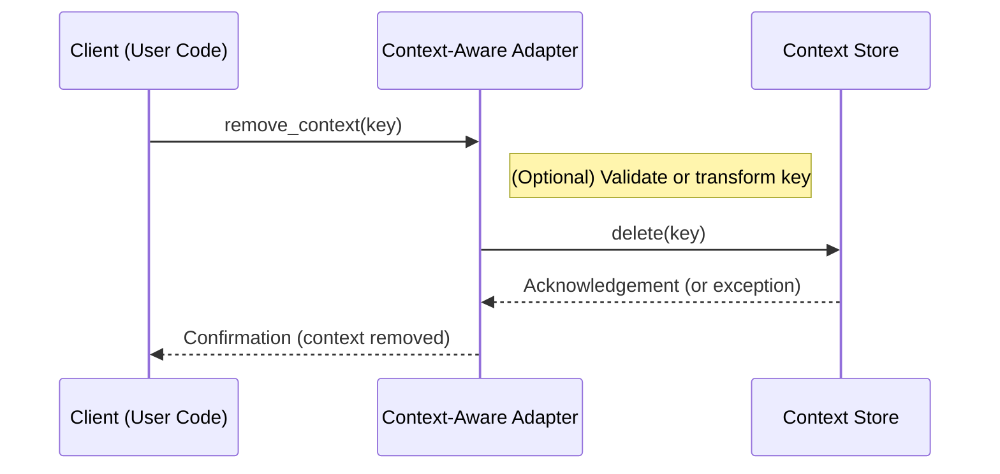
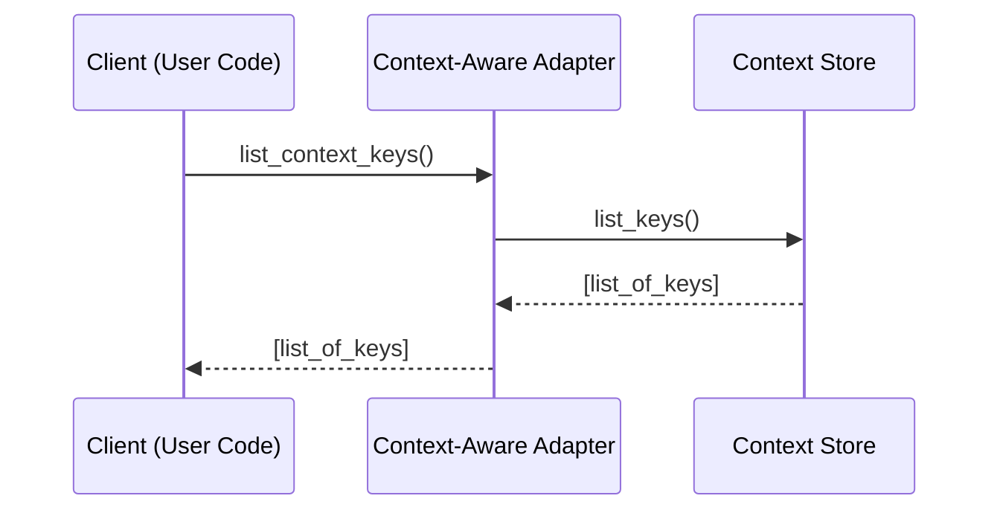
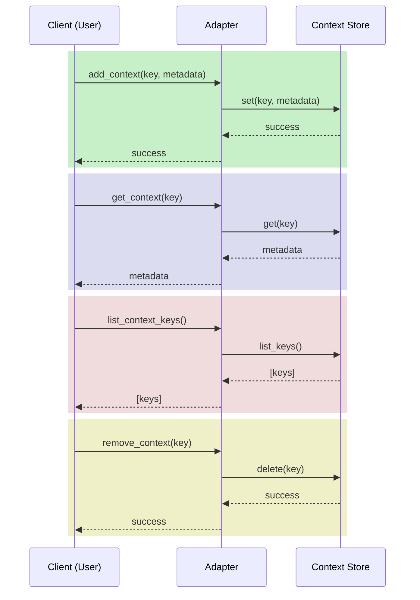

# Context-Framework: Sequence Diagrams

## Overview

The following sequence diagrams showcase how **context** (metadata) is added, retrieved, and removed within the **Context-Tracking Framework**. Key participants include:

- **Client (User Code)** – Could be a script, another library (like `thera-core/theralab`), or a multi-agent system calling our framework.
- **Context-Aware Adapter** – A class implementing `ContextAwareDataStructure` (e.g., `PandasContextAdapter`), which mediates interactions with the underlying data structure.
- **Context Store** – An implementation of `ContextStore` (e.g., `InMemoryContextStore`, `RedisContextStore`) that handles the actual storage of metadata.

These interactions follow a **standard request-response** pattern:
1. **Client** instructs the **Adapter** to add or retrieve context.  
2. The **Adapter** delegates the request to the **Context Store**.  
3. The **Context Store** performs the operation and returns the result.  
4. The **Adapter** then returns the result to the **Client**.

---

## 1. Adding Context

This diagram demonstrates how a client adds new metadata (context) for a specific `key` (e.g., a column name or row index) to a data structure adapter, which then stores it via the context store.

### Explanation

1. **Client → Adapter**: The user code calls `adapter.add_context(key, metadata)`.  
2. **Adapter** (optional step): May validate the `key` or transform it to match internal representation (e.g., `(“column”, “GeneSymbol”)`).  
3. **Adapter → Store**: The adapter calls `store.set(key, metadata)`, passing the **final** key-value pair.  
4. **Store → Adapter**: The store confirms the operation (success or exception).  
5. **Adapter → Client**: The adapter returns a confirmation, indicating that the context was successfully stored (or an exception if it failed).

---

## 2. Retrieving Context

This diagram shows the process of retrieving previously stored metadata. The client requests metadata for a particular key, and the adapter delegates to the store.

### Explanation

1. **Client → Adapter**: User calls `adapter.get_context(key)` to fetch stored metadata.  
2. **Adapter** (optional step): May perform logic to verify the key format.  
3. **Adapter → Store**: The adapter queries `store.get(key)` to retrieve the metadata.  
4. **Store → Adapter**: The context store returns the metadata if it exists, otherwise `None` (or raises a `ContextKeyError` if appropriate).  
5. **Adapter → Client**: The adapter forwards the metadata (or `None`/exception) to the client.

---

## 3. Removing Context

This diagram shows how the client removes or deletes context from the store.

### Explanation

1. **Client → Adapter**: The user code calls `adapter.remove_context(key)`.  
2. **Adapter** (optional step): May validate the key or ensure the key exists.  
3. **Adapter → Store**: The adapter calls `store.delete(key)` to remove the metadata.  
4. **Store → Adapter**: The store confirms the deletion or raises an error if the key does not exist.  
5. **Adapter → Client**: The adapter returns a confirmation (success) or an exception.

---

## 4. Listing All Context Keys

In some workflows, users need to see which keys currently have metadata. This diagram shows the **list_context_keys** flow.

### Explanation

1. **Client → Adapter**: The user calls `adapter.list_context_keys()`.  
2. **Adapter → Store**: The adapter delegates to `store.list_keys()`.  
3. **Store → Adapter**: The store returns a collection of all known keys.  
4. **Adapter → Client**: The adapter returns the key list to the caller.

---

## Combined Flow Example

Sometimes, a single user workflow involves multiple context calls in sequence:

1. User adds context for a column →  
2. Retrieves that context for verification →  
3. Lists all context keys →  
4. Potentially removes a key.

Below is a **condensed** sequence diagram showing this combined workflow:

---

## Notes on Error Handling

- In the above diagrams, if the **Context Store** raises exceptions (e.g., `ContextKeyError`, `ContextStoreError`), the **Adapter** either propagates them up to the client or translates them into a more user-friendly error message.  
- For instance, if `get(key)` fails because the key does not exist, the store might raise `ContextKeyError`. The adapter could choose to either raise the same exception or return `None`, depending on the design.

---

## Conclusion

These sequence diagrams clarify how metadata flows between the **Client**, **Adapter**, and **Context Store** in the **Context-Tracking Framework**. By following this pattern:

1. **Adapter** classes remain simple wrappers around their corresponding data structures.  
2. **Context Store** classes cleanly separate the responsibility of actual metadata persistence.  
3. **Clients** (user code, orchestrators, multi-agent systems) can easily add, retrieve, and manage context without knowing the details of the underlying storage.

**End of `sequence_diagram.md`**